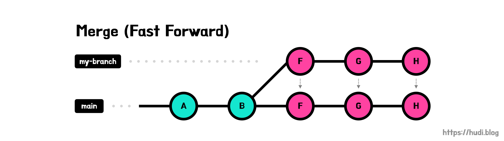

# Git merge fast forward

> Si l’historique entre deux branches est linéaire, alors un simple faste-forward est appliqué. Cela signifie que la branche de destination vas remonter les commits pour venir au même niveau que la branche a merge. Cela n’entraîne donc pas la création d’un commit de merge. 

 

## Comment se produit un fast forward
>Lorsque Git détecte que votre commit est sur le point d'être fusionné dans la branche principale de votre projet sans que la branche principale ait été modifiée depuis la création de votre branche de fonctionnalité, il choisit d'utiliser un fast forward. Les fast forward déplacent littéralement la pointe de votre branche principale vers la fin de votre branche de fonctionnalité . Cela permet de conserver de façon séquentiels tous les commits créés dans votre branche de fonctionnalité tout en les réintégrant parfaitement dans votre branche principale.
