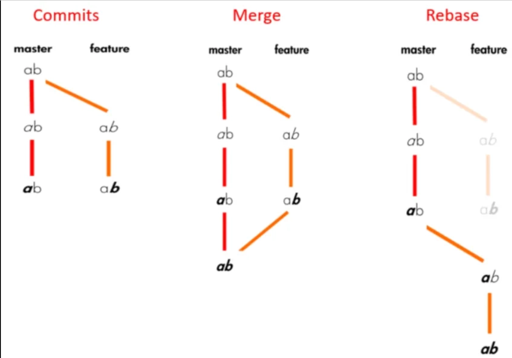
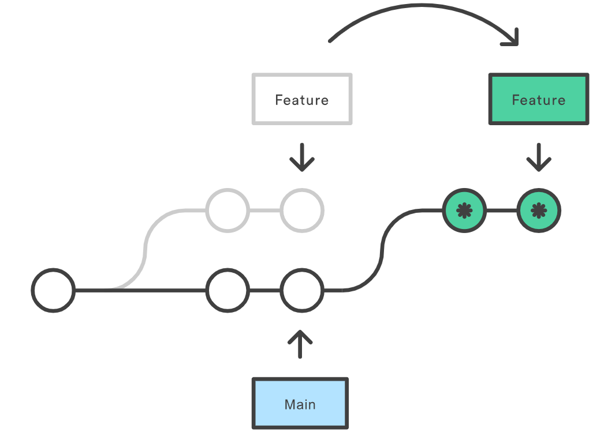

# Cheat Sheet Git et Github

That cheat sheet is about how to create a git project and how to use a simple version of git.

### 1. How to start a repository

### 2. Add, Save & Check

### 3. Send, Receive & Remote

List all remotes & upstreams
```bash
git remote -v
```

Add an *upstream*, from a fork for example
```bash
git remote add upstream https://github.com/[user]/[project].git
```

Pull from *upstream*
```bash
git fetch upstream
git merge upstream <branch>
```
ou
```bash
git pull upstream <branch>
```

### 4. Manage branchs

### 5. Remove, Restore & Revert

### 6. Merge & Rebase

| Command | Description |
| --- | --- | 
|`git merge <branch to integrate>`|Merge the specified branch history into the current one|
|`git rebase <commit id>` </br> `git rebase <from branch>`|Apply every commit of current branch ahead of a specified one|
|`git rebase -i <commit id or branch>` |Do the same as rebase but open a special interface to squash, edit, rename or delete commits|

<details>
<summary>Rebase & Merge understanding</summary>
</img></br> 

Both are used to integrate changes from one branch to another.

**Rebase :** The main purpose of `git rebase` is that it will allow to obtain a much more simplified history. It changes the "base" of your branch by adding the commits of another one to its origin.
    <details>
    <summary>Detailed scheme</summary>
    </img>
    </details>
</details>

*Warning : do your best to avoid making git rebase if you already pushed to a public repo the commits of the branch you are gonna rebase.*


### 7. Upstream

### 8. Compare, Diff & Log

Display diff between staging area and working directory
```bash
git diff --staged
```

RIGHT OUTER JOIN **branch_A** ON **branch_B**
```bash
git log branch_B..branch_A
git diff branch_B...branch_A
```

Show commit logs with paths that moved *(deleted/moved files)*
```bash
git log --stat -M
```

### 9. Others : must know

-------------------------------------- GIT STASH --------------------------------------

- git stash push -u -m "message" ........... Discard all changes since the last commit.
- git stash ................................ Create a stash without any informations.
- git stash save stashName (obsolete) ...... Save local changes (since last commit) in a stash with a specified name.
- branch nomDeBranch nomDuStash ............ Create a new branch from a specific stash and apply changes to it.
- git stash apply .......................... Apply changes from last stash.
- git stash apply stash@{n} ................ Applies changes to a specific stash without removing it from the list of stashes.
- git stash pop ............................ Applies and removes the last stash.
- git stash pop stash@{n} .................. Applies changes to a specific stash and removing it from the list of stashes.
- git stash list ........................... Show the stash list.
- git stash drop ........................... Delete the last stash.
- git stash drop stash@{n} ................. Remove a particular stash from the stash list.
- git stash show ........................... Show changes in most recent stash.
- git stash show stash@{1} -p .............. Inspect a particular stash.
- git stash clear .......................... Delete all stash.
