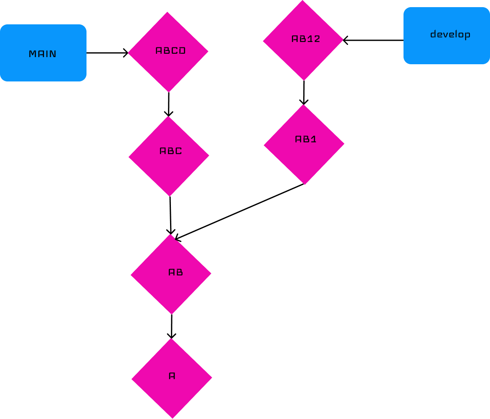
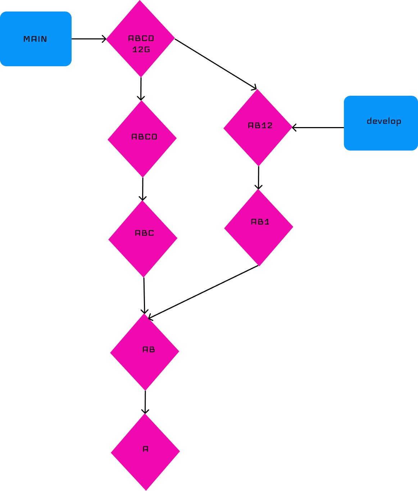

Cheat Sheet Git et Github

That cheat sheet is about how to create a git project and how to use a simple version of git.

1) How to start a repository

2) Add, Save & Check

3) Send, Receive & Remote

4) Manage branchs

5) Remove, Restore & Revert

6) Merge & Rebase
# GIT MERGE

### De quoi est constitué une branche ?

Une branche est constitué d'une reférence avec un label que l'on peut voir comme un pointeur vers un commit et tous lec ommits parents de celui ci

### A quoi correspond un merge ?
L'idée du merge est de ramener dans ma branche main les modifications apportés dans la branche develop.
Pour réaliser le merge de deux branches.
Il faut se positionner sur la branche dans laquelle on souhaite rappatrier les modifications de la branche cible 

ici 
```
$ git switch main
```

Une fois que l'on a fait cela on va pouvoir realiser le merge.
Et pour cela on va utiliser la commande

```
$ git merge develop
```
Git crée alors un nouveau commit que l'on appelle aussi commit de merge qui permettent de ramener dans ma branche main les modifications apportées par la branche develop



7) Upstream

8) Others : must know


